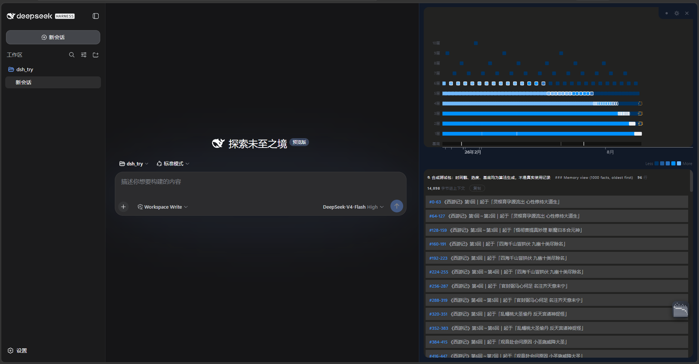
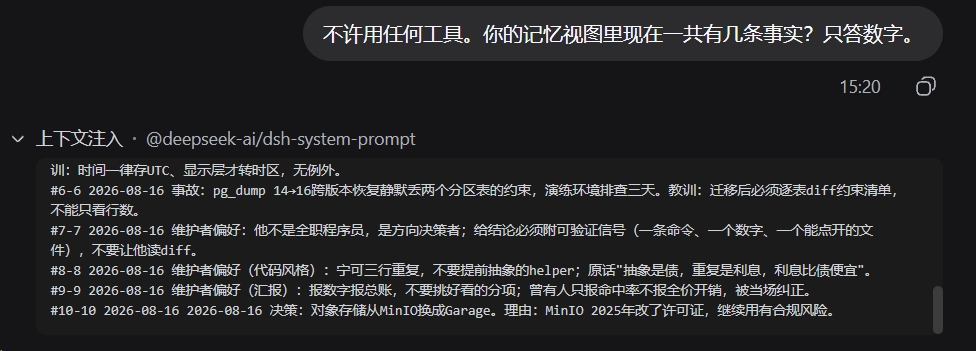
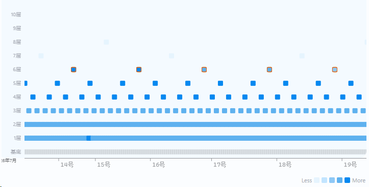
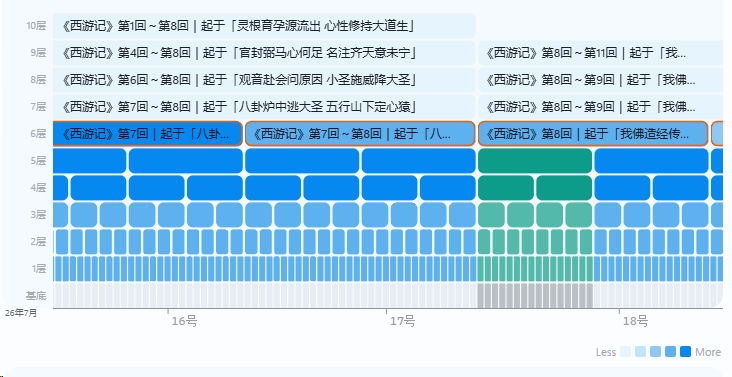

<div align="center">

  <h1>dsh-memory-pyramid</h1>

  <p>
    
    
    
  </p>

  <p><strong>Timeline memory</strong> for <a href="https://github.com/deepseek-ai/deepseek-harness">DeepSeek Harness (dsh)</a>: an append-only log of facts, plus a summary pyramid the agent maintains by itself.<br/><strong>Ten thousand memories wake as 96 lines (≈7.3k tokens); any single memory is one seek away.</strong> Zero dependencies, plug and play.</p>

  <p>
    <a href="#quick-install"><strong>Quick Install</strong></a>
    ·
    <a href="#why-pyramid"><strong>Why "Pyramid"</strong></a>
    ·
    <a href="#roadmap"><strong>Roadmap</strong></a>
  </p>

  <p>
    
    = 19" />
    
  </p>

  <p><sub>Built with Fable 5</sub></p>

  <p><a href="README.md">中文</a> | English</p>

</div>

---

Once installed, every session wakes up with the pyramid memory injected; as memories accumulate, the view compresses into pyramid shape:

```
### Memory view (40 facts)

#0-31   Summary: spent this stretch getting plugin loading to work; conclusion: third-party plugins install via CLI only
#32-35  Summary: moved injection to the dynamic runtime-context channel; cache hit rate recovered from 40% to 91%
#36-37  Summary: data directory now lives in the workspace, keeping runtime data out of the home directory
#38     2026-08-15 summary tree stored per block size; the to-do list is derived from file length, no queue to drift
#39     2026-08-15 fixed-width records carry no sequence number: position is identity, concurrent appends are naturally safe
```

The closer to now, the more verbatim; the older, the coarser — but **not a single original line is ever lost**, and you can drill back down at any time.

Here is the same thing from your side of the screen:



## Why "Pyramid"

Every time two facts fill up, the agent writes one line that stands for them; when two of *those* lines pair up, it writes one coarser line. Each layer holds half as many blocks as the one below — the shape is a tower:

```
                  [ #0-127 ]                      ← 1 line · covering all 128 facts
            [ #0-63 ]    [ #64-127 ]              ← each line covers 64
      [#0-31] [#32-63] [#64-95] [#96-127]         ← each line covers 32
   ········································
  #0 #1 #2 #3 ··················· #126 #127       ← the base: 128 verbatim facts
```

The wake-up view walks a **diagonal staircase down the tower**: last year is one line at the peak, last month sits behind a mid-layer brick, yesterday you read verbatim at the base. The base never moves — coarse bricks are only the map, and `memory_zoom` takes you down to the originals in two lines. So memory can grow tenfold and the view doesn't gain a line.

The shape takes its cue from Victor Taelin's [OptMem](https://github.com/VictorTaelin/OptMem). **The shape is the reference; everything else we worked out ourselves inside dsh** — see the features below.

## The slot it fills

| | Axis | What it remembers |
|---|---|---|
| `agent-instructions` (AGENTS.md chain) | Space | Which rules apply in which directory |
| Retrieval memory (RAG family) | Relevance | Things similar to the current question |
| **dsh-memory-pyramid** | **Time** | **What happened, in what order, and why it was decided that way** |

The three axes are orthogonal and stack cleanly. Officially only the space axis is occupied — **the time axis is entirely empty**. That's where this plugin lands.

The serial edition works today and runs **nothing in the background**. On the roadmap are two things you won't find elsewhere: **parallel background settlement** (memory-writing handed to a dedicated clone, costing your main thread zero attention) and a **memory dashboard** (humans get to see their own memory too — click a fact, jump back to the conversation that produced it).

## Features

**The pyramid mechanism**

- One fact per line, ≤280 bytes, append-only, never edited; summaries maintained by the agent as it writes — no background process, no timers
- Fixed reading budget: when everything fits, nothing is compressed; when it doesn't, older gets coarser — **never cut off**
- Bad summaries have a formal redraw channel (`memory_forget`), cascading to every coarser summary derived from them

**dsh-native adaptation (friction we solved ourselves)**

- Native dsh tools, not an external CLI — no shell permission needed
- **The injection channel was chosen on real API bills**: putting the view in the system prompt wrecks the prompt cache; moving it to the official dynamic runtime-context channel took whole-session hit rates from 40% to 91% (ledger below)
- **Session-range anchors**: every fact records which slice of conversation it was distilled from (`sessionId` + seq range) — dsh keeps a full event stream of every session, raw material that doesn't exist in OptMem's environment
- **Every integration channel was tested before we picked a seat**: the AGENTS.md channel (`agent-instructions`) ships root-flagged as disabled yet turns out alive in real sessions — but it's built for static, per-directory rules (cascading, never summarized); a memory view that changes on every write belongs in the official dynamic runtime-context channel
- Data-directory claiming / auto-migration / refusal to splice — better to not work than to write into someone else's directory

**Engineering properties**

- **Zero npm dependencies, zero native modules**; Node ≥ 19
- Windows / Linux / macOS / ARM64 (full green acceptance run on a postmarketOS phone)
- Multiple processes write the same memory **lock-free and correctly** — by removing a field, not adding a mutex
- Data lives in your workspace as plain text, diff-friendly; whether it goes into git is your choice

## Quick Install

Prerequisites: pnpm on PATH — dsh uses it to manage plugins on every platform (`npm install -g pnpm`; if the global directory isn't writable, `npm install -g pnpm --prefix ~/.local` and put `~/.local/bin` on PATH). Installing from source additionally needs git; the plugin itself has zero dependencies, no build step, Node.js ≥ 19.

One command:

```bash
dsh plugin --profile web add dsh-memory-pyramid
```

Installed means activated — the package declares `dsh.bundle`, so dsh adds it to the profile's layer stack automatically. **Not a single config file to edit.** The next new session wakes up with the Memory view. (You can also just ask your dsh agent to run the install for you.)

Uninstalling is one command too: `dsh plugin --profile web remove dsh-memory-pyramid`.

<details><summary>Install from source (to track the latest code)</summary>

```bash
git clone https://github.com/33moren33/dsh-memory-pyramid.git
dsh plugin --profile web add "link:/absolute/path/dsh-memory-pyramid"
```

</details>

To change configuration (e.g. `wakeLines`), override the same id in your profile's `cordis.patch.yml` — hot-reloaded:

```yaml
- id: memory
  config:
    wakeLines: 192
```

**A real injection** (real session, zero tools — the model answers straight from the injected view):



## Configuration

| Key | Default | Description |
|---|---|---|
| `namespace` | none | A shared-area name. If set, data lands in `<workspace>/<name>/dsh_memory`. Single directory name only. |
| `dataDir` | none | Fully custom path (absolute, or relative to the workspace root). **Overrides** `namespace`. An absolute path also overrides the workspace, so every workspace reads the same library — this is how you get one shared brain. |
| `migrate` | `true` | When the location changes, automatically move the old memory found in the workspace. |
| `wakeLines` | `96` | Line budget of the memory view. **A reading budget, not a storage budget** — change it any time; nothing is recomputed. |
| `injectWake` | `true` | Whether to inject the memory view at session start. Turned off, the tools still work; the view just stops appearing on its own. |
| `packs` | none | Mount further memory libraries onto the dashboard for reference, as `[{name: "example", dir: "path"}]`. **Not one byte is written to them**: no usage ledger, no summary upkeep, no injected view. Four sample libraries already ship with the plugin (see above); this option is for adding your own. |
| `liveView` | `false` | Whether the view updates live as memory changes mid-session. Off (default): the view is injected once at session start; facts written mid-session stay visible through tool receipts, and every new session opens with the full latest view. On: every memory change appends a fresh full view to the session (more injected tokens). Hot-reloaded — the current conversation follows the new setting from its next message. |

Data defaults to `<workspace>/dsh_memory` (never the home directory). `LOG.txt` is plain text, append-only — commit it and a team shares one lived history; `TREE/` is pure cache, deleting it loses no facts. If the directory already exists: a matching identity marker is claimed untouched; anything else is refused with an explanation. **Two memories are never spliced** (records are addressed by position; splicing would silently shift every summary reference) — multiple old copies found means refuse and let a human decide.

## Tools

| Tool | What it does |
|---|---|
| `memory_note` | Record one fact. One line, ≤280 bytes, append-only, never edited. |
| `memory_summarize` | Pay the pyramid's upkeep: when a block fills, write the one line that will represent it. |
| `memory_zoom` | Open any `#a-b` node into its two halves — the cheap way to drill down. |
| `memory_recall` | Scan all facts with a regular expression (`from`/`to` bound the scan), or read a range of originals. A shortened answer reports how many matches it held back. Every fact comes with its session anchor. |
| `memory_open` | Follow one fact's anchor back and hand over the full source it was distilled from. |
| `memory_forget` | Discard a bad summary and queue a rewrite. **Redraws the map, never touches the territory.** |

## Memory dashboard

Once installed, a floating button appears in the bottom-right corner; open it and the dashboard takes the right half of the screen — **the first time your memory is something a human can look at.**

A real tower: one brick is one summary, the bottom row is individual facts. The lit ones are what is being injected into the model right now — **same data, same algorithm** as the view the model receives, so there is no second source of truth. Colour encodes exactly one thing: heat, meaning how often that memory has actually been used.



Higher layers hold fewer bricks, each covering more; the top row stands for everything. **The orange-outlined bricks are the ones in the context right now** — you can see at a glance what the model actually read at session start.

Zoom in and each brick carries the text of the stretch it represents:



A timeline underneath marks the span these memories cover; it pans and zooms, and the tower itself pans vertically when it grows taller than the card.

The knobs in the bottom-right take effect immediately: injected line count, bytes per fact, frozen vs. live.

The dashboard mounts through the front door dsh leaves open for third parties. Where there is no web UI (headless, for instance) it is simply absent, and memory itself keeps working.

### Click a memory, land on where it came from

Click a brick to read its text. Click a fact on the bottom row to walk back to its origin:

- **Came from a conversation** — jumps back to that conversation. Every fact stores a `sessionId` plus a range of sequence numbers, so what gets highlighted is **a complete turn**, not a single point.
- **Came from imported text** — opens that source in full.

When a fact has no recorded origin the button is greyed out. It never pretends to have one.

### Four sample libraries ship with the plugin

A tower of fifty facts and a tower of a few thousand are **completely different objects** — at fifty, the whole library fits in the context and not a single summary block is used; only in the thousands do the layers appear. But someone who just installed the plugin has zero facts.

So the package ships four ready-made libraries — **50 / 100 / 500 / 1000 facts** — switchable from the top-left of the dashboard the moment you install. No configuration, no download, and nothing is copied into your workspace. They are there in every workspace you open.

Switching to one shows **exactly what your own library shows**: the same tower, the same cards, the same memory view produced by the same algorithm. The difference speaks for itself — at 50 facts the view is 51 lines of verbatim originals and not one summary block is used; at 1000 it is 97 lines that open with coarse bricks like `#0-63`. **Both fit inside the same 96-line budget**, which is the claim "twenty times the memory, not one extra line to read at session start" stated as something you can look at.

All four are marked **⚗ synthetic**: the text is a public-domain novel, and the timestamps and heat values are generated, not anyone's real usage. That marking lives inside the library itself, so it travels wherever the library is copied and **can never be misread as a real ledger**.

The sample libraries are read-only — the dashboard does not write a single byte into them. And because they live inside the plugin's install directory rather than your workspace, the dashboard offers no unmount button for them. **Walking back to an origin does not work inside a sample library yet**: their conversation transcripts ship inside the pack but were never registered with dsh, so the click does nothing. In your own library it works normally.

There is also a 10,000-fact library, too large to ship in the package; it will be offered as a Releases download. Mounting any other library works the same way: **drop it into `<your workspace>/dsh_memory/packs/`** and the dashboard picks it up, or type the path into the dashboard directly.

## Importing existing text

The tower has three layers: **source material** is the raw input, a **fact** is the single ≤280-byte line distilled from it, and a **summary** is the coarser brick that facts merge into. Source material has no length limit — a slice of conversation is source material, and so is any document you already have.

Inside the memory directory there is a `memory_handoff/` folder, and **putting a file in it counts as shelving it** — there is no write tool; the folder itself is the entrance. Markdown is merely the most convenient format; any plain text works.

Shelved is not the same as stored: a file placed there is only raw material. It enters the tower when someone reads it and writes a fact from it. **One source, one fact, strictly one-to-one** — which is why any fact leads back to exactly one origin.

Every fact written this way carries an anchor to the source it came from, and `memory_open` follows that anchor back to the full text: the detail a one-line fact cannot hold is always one step away.

Byte count and fingerprint are recorded at shelving time. If the file is edited afterwards, opening it says so outright instead of handing you the new bytes as if nothing happened.

## Why it never slows down

1. **Fixed-width records ⇒ position is identity.** Fact N lives at byte N×384, forever; reading one fact is one `pread`. Records store no sequence number — which also makes concurrent appends naturally correct.
2. **The summary tree is fixed-width too, one dense-prefix file per layer.** "How far has this layer gotten?" = file length ÷ 288, one `stat`. The to-do list is *derived* — there is no queue that can drift.
3. **Compression work is constant.** Small blocks (≤16 facts) compress from originals; larger blocks read only their two half-block summaries. Layer 10 costs the same as layer 1, and a written summary is never reworked.
4. **The reading budget is fixed, and nothing is truncated.** A binary search finds the coarsening rate that exactly fits; when everything fits, nothing is compressed. Changing the budget recomputes zero summaries.

### Why it never breaks the prompt cache

**The discipline text (static) lives in the system prompt; the memory view (changes on every write) lives in the dynamic context.** The dividing line is one question: *will this text change?* Measured on real API traffic (an 8-turn session writing 6 facts and paying 6 compression debts):

| | View in system prompt (the wrong way) | View in dynamic context (now) |
|---|---|---|
| Cacheable-prefix invalidations | 5 | **0** |
| Full-price input tokens | 95,362 | **11,618** |
| Whole-session cache hit rate | 40% | **91%** |

The cost is **independent of turn count — it only depends on how many times the memory actually changed**.

### Summaries will be wrong, and that's part of the design

The top of the pyramid is a multi-generation game of telephone; meaning drifts. So the originals are permanent (a broken map doesn't sink the territory), `memory_forget` is the formal redraw channel, and a missing summary makes the view split that block finer until it reaches originals — it never displays a summary that doesn't exist.

## Roadmap

- [x] v0.1 serial edition: five tools, session-range anchors, cache-safe injection, byte-level OptMem `TREE/` compatibility
- [x] v0.1.1 injection switch: by default the view is injected once at session start (`liveView` switches back to live updates, hot-reloaded)
- [x] **Memory dashboard**: pyramid-layer view plus a timeline, clicking a memory jumps back to the conversation slice that produced it, four sample libraries included for comparison
- [x] **Text into the tower**: shelve any existing document in `memory_handoff/` as source material; facts carry an anchor back to the full original
- [ ] **Injection refinement**: incremental dynamic injection — track what each session has already seen and inject only what it hasn't
- [ ] **One brain across workspaces**: merge several workspaces' libraries into a single view
- [ ] **Pyramid tutorial**: flowcharts and screenshots explaining how the tower is built, read, broken, and repaired
- [ ] **Parallel settlement**: hand memory-writing to a dedicated clone so the main thread is never interrupted; an idle sweeper picks up unclaimed conversation ranges
- [ ] OptMem `LOG.txt` migration converter (`TREE/` can be moved as-is)

## Known Limits

- **Where the memory lands**: in `dsh_memory/` under **the workspace you opened in dsh**. Switch workspaces in the UI and the memory switches with you — one workspace, one library, the same way dsh keeps sessions per workspace. If a workspace looks empty, the memory is almost certainly not lost: it belongs to a different project. That separation is deliberate — one project's history has no business in another project's context. To pin one library everywhere, set `dataDir` to an absolute path; it overrides everything.
- The peer-dependency warning `@deepseek-ai/cordis missing` is harmless: cordis is only referenced in type annotations, never imported at runtime, and dsh ships its own. Removed as of v0.1.1; safe to ignore on older versions.
- Concurrent multi-process writing is supported and lock-free; but **sub-agents should not write memory** (they can't see what's already recorded). Currently enforced by prompt convention, not by code.
- **One workspace, one library; several libraries cannot yet be merged into a single view.** To share one memory across projects, point `dataDir` at the same absolute path.
- Early version; the injection shape is still evolving (see the first Roadmap item). **Full reliability claims are left to real-world testing and issue reports** — if you hit something, please open an issue.

## License

This project is licensed under the [MIT License](./LICENSE).
